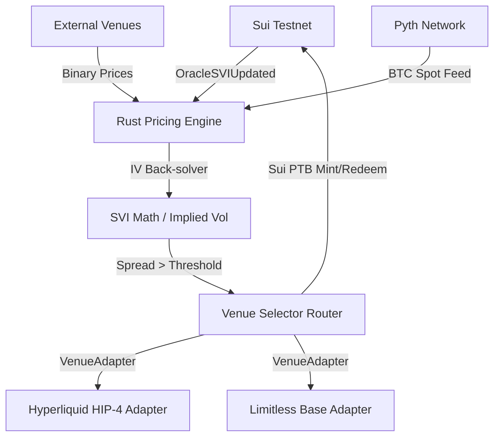

# 🎯 SviMarlin

> **Multi-venue volatility arbitrage engine trading DeepBook Predict's `OracleSVI` against external prediction markets.**

SviMarlin is a high-performance quant trading engine that back-solves implied volatility (IV) from DeepBook Predict’s on-chain SVI surface, detects discrepancies against external venues (Hyperliquid HIP-4, Limitless, and Polymarket), and executes atomic spread trades with optional delta-hedging.

---

## 🌊 The Pain Point
Prediction markets have seen explosive growth (~$200B/yr run-rate by mid-2026), yet they remain structurally inefficient:
- **Volatility Blindness:** Standard prediction platforms quote binary probability, unable to price a volatility smile, skew, or term structure.
- **Fragmented Volatility:** The same underlying risk trades at wildly different implied vols across fragmented pools (often **20–40 vol points apart**).
- **Passive LP Stagnation:** DeepBook Predict provides an on-chain Stochastic Volatility Inspired (SVI) surface, but without automated arbitrageurs to stress-test it, liquidity pools (PLP) earn sub-optimal yield.

---

## 🎯 The Solution: SviMarlin
SviMarlin acts as the lightning-fast bridge closing the volatility gap:
1. **Implied Vol Solvers:** Streams `OracleSVIUpdated` events from Sui and back-solves the on-chain SVI volatility surface.
2. **Multi-Venue Aggregator:** Pulls live event prices from **Hyperliquid HIP-4 (primary leg)** and **Limitless on Base (secondary leg)**, converting binary option prices into clean implied volatilities.
3. **Execution Engine:** When a spread $| \Delta \sigma |$ exceeds trading costs, the bot mints the underpriced contract via `predict::mint` on Sui and sells the overpriced leg on the external venue.
4. **Risk Mitigator:** Includes built-in Kelly sizing, Pyth price sanity checks, stale-SVI watchdogs, and an optional Hyperliquid perp leg to delta-hedge residual exposure.

---

## 🛠️ System Architecture



- **Rust Quant Core:** High-performance SVI fitting and pricing calculations.
- **`VenueAdapter` Trait:** A pluggable interface for executing trades across diverse execution environments (EVM, Hyperliquid L1, Sui).
- **Risk Engine:** Real-time stale oracle feed detection, Kelly sizing, and a global circuit breaker.

---

## 🚀 Quick Start

### Prerequisites
- Rust toolchain (2024 edition)
- Sui CLI configured with testnet credentials

### Build & Run
```bash
# Clone the repository
git clone https://github.com/your-username/svimarlin.git
cd svimarlin

# Build the trading core
cargo build --release

# Run the arbitrage bot in dry-run mode
cargo run --bin bot -- --dry-run
```

---

## 📊 Performance & Backtesting
SviMarlin includes a historical replay tool to simulate performance over 2 weeks of raw `OracleSVI` events.
```bash
cargo run --bin backtest -- --start-date 2026-06-01 --end-date 2026-06-15
```

---
*Developed for Sui Overflow 2026 — Track 2: DeepBook & Prediction Markets.*
